# Library Management System — Project Report

**Course:** Spring Boot Web Application Development
**Institution:** BITS Pilani
**GitHub:** [@Manasvi-247](https://github.com/Manasvi-247) &nbsp;·&nbsp; [library-management-springboot](https://github.com/Manasvi-247/library-management-springboot)

---

## 1. Overview

**Inkwell** is a Spring Boot reference application that manages two related
entities — **Author** and **Book** — through a web UI built with JSP. The
application demonstrates:

- JPA entity modelling with a One-to-Many relationship.
- Repository, service, and controller layering with clear separation of concerns.
- Three CRUD operations per the assignment (**Create**, **Read**, **Update**).
- A custom **INNER JOIN** JPQL query projecting into a DTO.
- Form validation, integrity-violation handling, and a polished JSP UI.
- Unit tests for the repository and service layers.

---

## 2. Entity-Relationship Design

Two entities, related as **Author 1 — N Book**:

```
┌──────────────────┐  1     N  ┌────────────────────┐
│ Author           │───────────│ Book               │
│──────────────────│           │────────────────────│
│ id (PK)          │           │ id (PK)            │
│ name             │           │ title              │
│ email (UNIQUE)   │           │ genre              │
│ country          │           │ published_year     │
│ birth_year       │           │ price              │
└──────────────────┘           │ author_id (FK)     │
                               │  UNIQUE(title,     │
                               │         author_id) │
                               └────────────────────┘
```

### Constraints (also drive the integrity-violation demo)

| Constraint                                | Why                                                    |
|-------------------------------------------|--------------------------------------------------------|
| `Author.email` UNIQUE                     | Prevents two authors sharing an email.                 |
| `Book(title, author_id)` UNIQUE composite | Same author cannot have two books with the same title. |
| `Book.author_id` NOT NULL + FK            | Every book must reference an existing author.          |
| Bean Validation on form fields            | Client-side rejection before the DB is touched.        |

### JPA mapping highlights

- `Author.books` — `@OneToMany(mappedBy = "author", cascade = ALL, orphanRemoval = true)`
- `Book.author` — `@ManyToOne(fetch = LAZY, optional = false)` + `@JoinColumn(name = "author_id")`
- Bean Validation: `@NotBlank`, `@Email`, `@Min`, `@Positive`, `@NotNull`.

> **File references:** [`Author.java`](src/main/java/com/bits/library/entity/Author.java), [`Book.java`](src/main/java/com/bits/library/entity/Book.java)

---

## 3. Layered Architecture

```
JSP views ── Controllers ── Services ── Repositories ── Database
                              │
                              └─── @ControllerAdvice (GlobalExceptionHandler)
```

| Layer       | Responsibility                                                      |
|-------------|---------------------------------------------------------------------|
| Controller  | HTTP request/response, model binding, validation, flash messages.   |
| Service     | Transactional business logic, domain exceptions.                    |
| Repository  | Spring Data JPA — derived methods + custom JPQL.                    |
| View        | JSP + JSTL/EL with form-binding tags.                               |

---

## 4. Implementation Details

### 4.1 Populating the database

`config/DataSeeder.java` is a `CommandLineRunner` that inserts **10 authors and
10 books** on startup if the tables are empty. This guarantees the grader sees a
populated database the moment the app starts.

```java
@Component
public class DataSeeder implements CommandLineRunner {
    public void run(String... args) {
        if (authorRepository.count() > 0) return;
        // 10 authors + 10 books inserted via saveAll(...)
    }
}
```

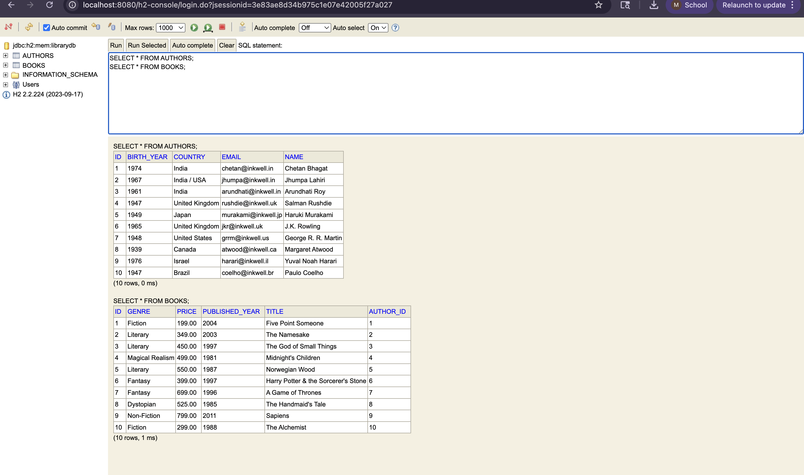
*Figure 1 — H2 console: both `AUTHORS` and `BOOKS` tables populated with the 10 + 10 sample rows from `DataSeeder`.*

### 4.2 Create operation

- JSP form: [`authors/form.jsp`](src/main/webapp/WEB-INF/views/authors/form.jsp), [`books/form.jsp`](src/main/webapp/WEB-INF/views/books/form.jsp)
- Controller: `POST /authors` and `POST /books`
- `@Valid` triggers Bean Validation; errors are re-rendered into the same form via `BindingResult`.
- Successful creates redirect with a flash message ("Author 'X' created successfully").
- Duplicate email or duplicate `(title, author)` triggers `DataIntegrityViolationException`,
  caught by the global handler and rendered through `error.jsp`.

```java
@PostMapping
public String create(@Valid @ModelAttribute("author") Author author,
                     BindingResult bindingResult, ...) {
    if (bindingResult.hasErrors()) return "authors/form";
    Author saved = authorService.create(author);
    redirect.addFlashAttribute("flashSuccess", "Author '" + saved.getName() + "' created.");
    return "redirect:/authors";
}
```

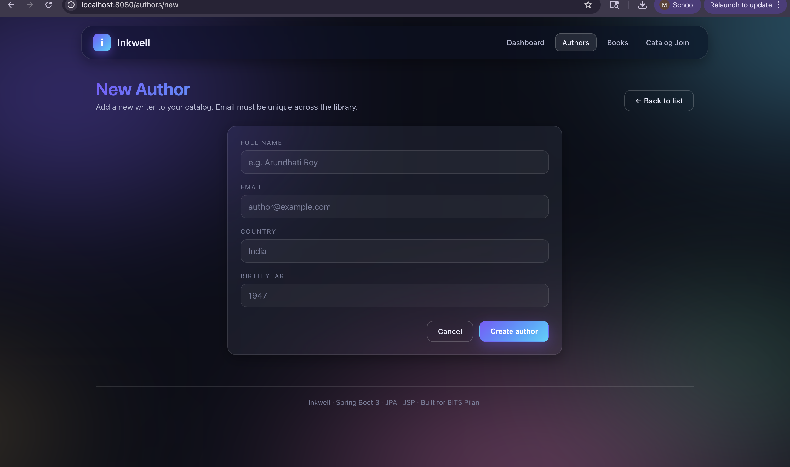
*Figure 2 — `GET /authors/new`: empty form rendered by `authors/form.jsp`.*

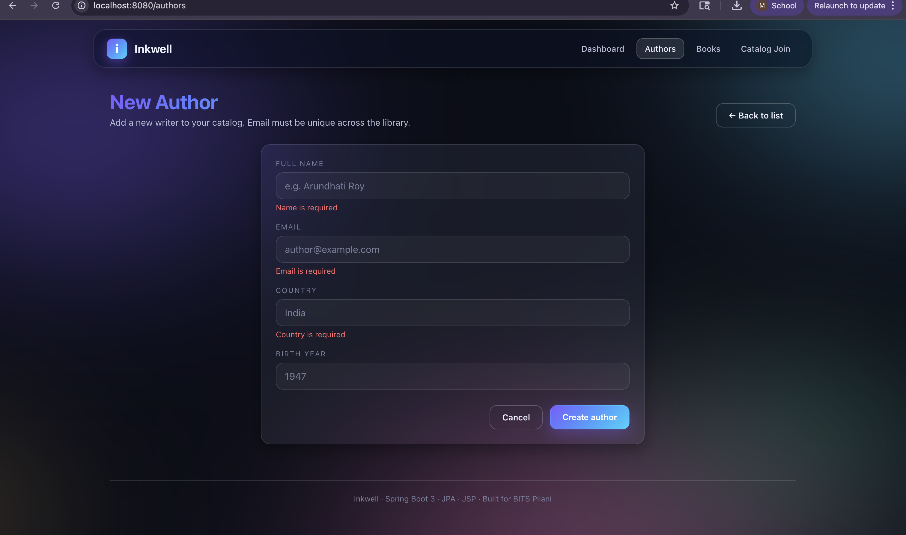
*Figure 3 — Bean Validation errors surfaced via `BindingResult` and Spring's `<form:errors>` tag — the form re-renders with red error messages under each field.*

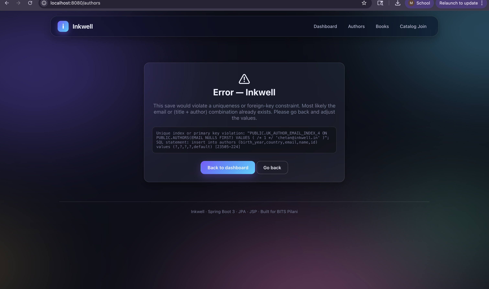
*Figure 4 — Duplicate email triggers `DataIntegrityViolationException`, caught by `GlobalExceptionHandler` and rendered as a styled 409 page with the underlying constraint name.*

### 4.3 Read operation

- List views at `/authors`, `/books`.
- The **inner-join** projection lives at `/books/joined` and uses this JPQL:

```java
@Query("SELECT new com.bits.library.dto.AuthorBookView(" +
       "  a.name, a.country, b.title, b.genre, b.publishedYear, b.price) " +
       "FROM Book b INNER JOIN b.author a " +
       "ORDER BY a.name ASC, b.publishedYear DESC")
List<AuthorBookView> findAllAuthorsWithBooks();
```

The view layer never touches lazy associations because the query returns a flat
`AuthorBookView` DTO. A second variant (`findByGenreJoined`) supports filtering
by genre — wired up to a small filter bar in the joined view.

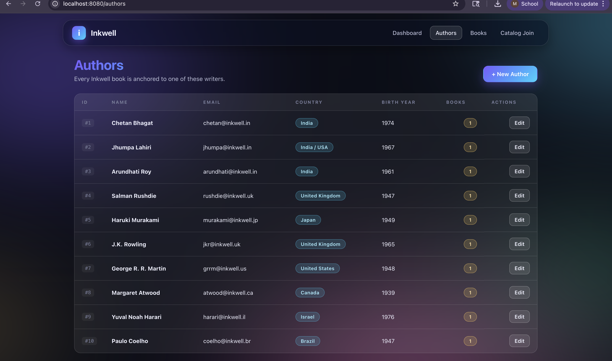
*Figure 5 — `GET /authors`: all 10 authors rendered with country pills, book-count badges, and edit actions.*

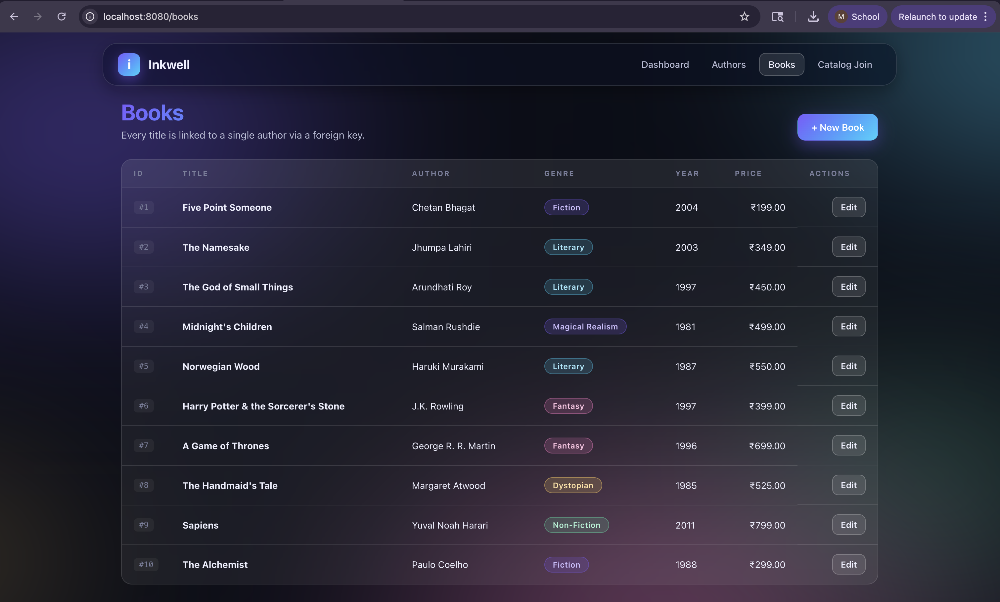
*Figure 6 — `GET /books`: all 10 books with genre pills (Fiction / Literary / Magical Realism / Fantasy / Dystopian / Non-Fiction) and prices.*

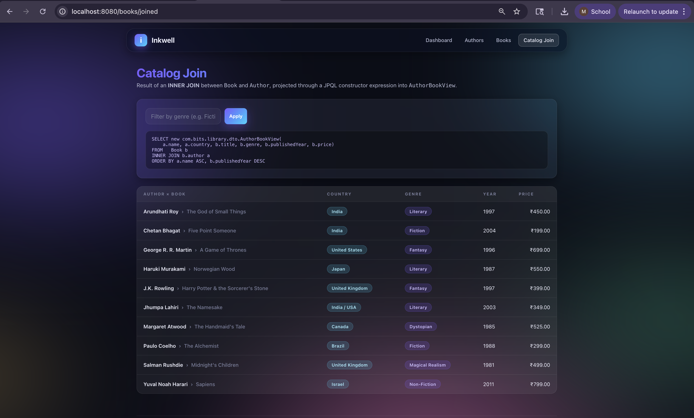
*Figure 7 — `GET /books/joined`: result of the JPQL `INNER JOIN`, projected into `AuthorBookView`. The exact query is shown above the table for transparency.*

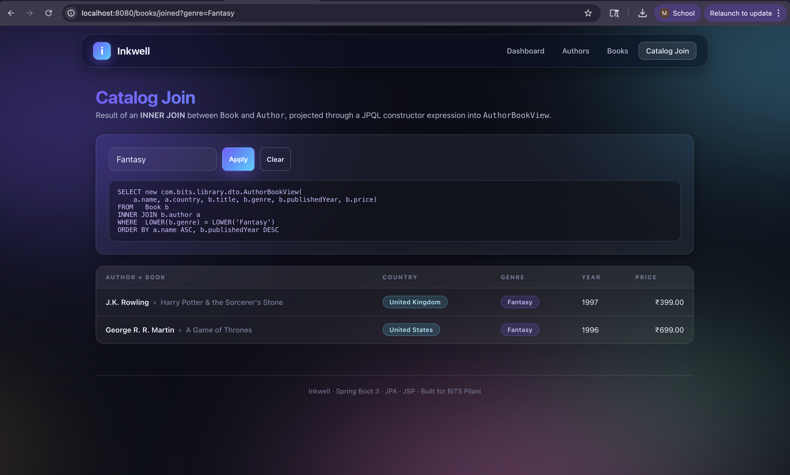
*Figure 8 — `GET /books/joined?genre=Fantasy`: same query with an added `WHERE LOWER(b.genre) = LOWER(?)` clause — returns just the two Fantasy titles.*

### 4.4 Update operation

- Edit forms at `/authors/{id}/edit` and `/books/{id}/edit`.
- Submitting `POST /authors/{id}` or `POST /books/{id}` calls
  `authorService.update(id, ...)` / `bookService.update(id, ...)`.
- The service fetches the existing entity, copies in the new field values, and
  re-saves — keeping the JPA-managed identity stable.

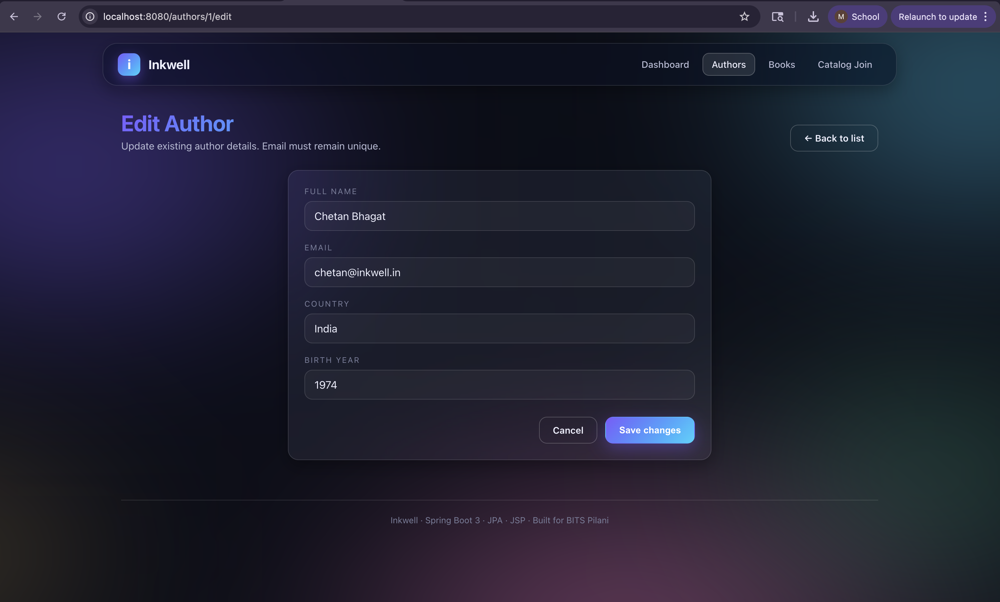
*Figure 9 — `GET /authors/1/edit`: form pre-populated with the existing record (Chetan Bhagat / India / 1974).*

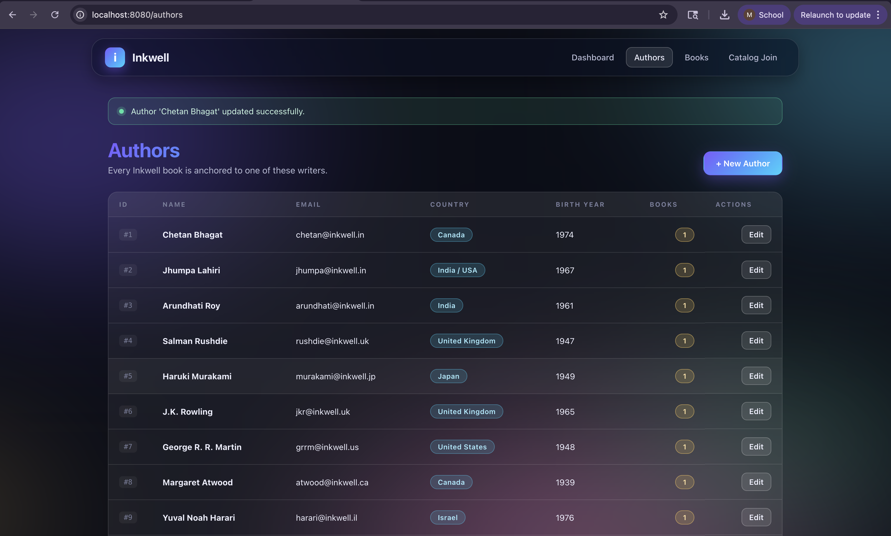
*Figure 9b — After submission, the redirect renders `flashSuccess` ("Author 'Chetan Bhagat' updated successfully") and the country pill now reads **Canada** — proving the update persisted through the service → repository → DB chain.*

### 4.5 Exception handling

`GlobalExceptionHandler` (`@ControllerAdvice`) handles:

| Exception                              | HTTP | User message                                                |
|----------------------------------------|------|-------------------------------------------------------------|
| `DataIntegrityViolationException`      | 409  | "Duplicate or invalid data — uniqueness/foreign-key broke." |
| `AuthorNotFoundException` / `Book…`    | 404  | "Record not found."                                         |
| Any other `Exception`                  | 500  | "Something went wrong" + cause detail.                      |

All errors render through a single styled [`error.jsp`](src/main/webapp/WEB-INF/views/error.jsp) page.

---

## 5. View Layer & UI

The UI is built on a small custom design system using only CSS (no framework):

- Animated mesh-gradient background with two overlapping radial layers.
- Glassmorphism cards (`backdrop-filter: blur`).
- Coloured "pill" badges for genre and country.
- Sticky frosted navbar with active-route highlighting.
- Responsive table that collapses into stacked rows on mobile.
- Flash messages, validation errors, and a friendly error page.

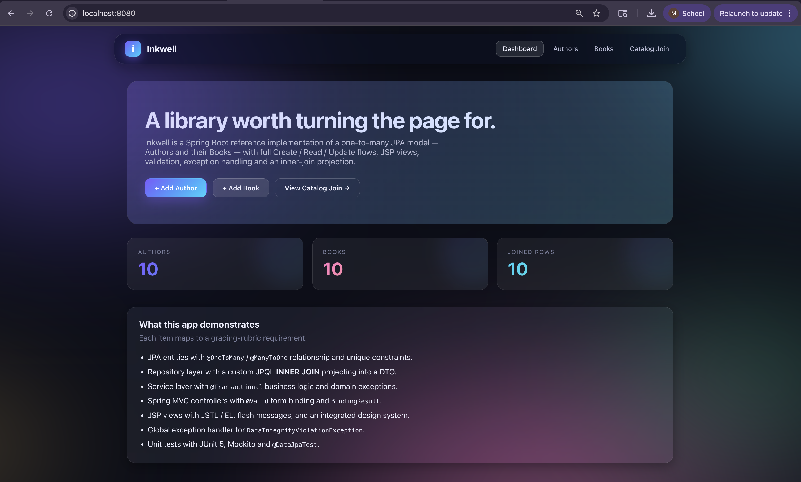
*Figure 10 — `GET /`: dashboard hero with three live stat cards (Authors / Books / Joined Rows) plus a feature-checklist card.*

---

## 6. Testing & Validation

| Test class                        | Type             | What it proves                                                        |
|-----------------------------------|------------------|-----------------------------------------------------------------------|
| `BookRepositoryTest`              | `@DataJpaTest`   | Inner-join returns correct rows, excludes authors with no books, genre filter is case-insensitive, unique-email + unique-(title, author) constraints throw `DataIntegrityViolationException`. |
| `AuthorServiceTest`               | Mockito          | `findAll`, `findById` (success + miss), `create`, `update` field copy. |
| `BookServiceTest`                 | Mockito          | Author resolution on create, field copy + author reassignment on update. |
| `LibraryApplicationTests`         | `@SpringBootTest`| Full Spring context wires up cleanly.                                 |

Run with:
```bash
mvn test
```

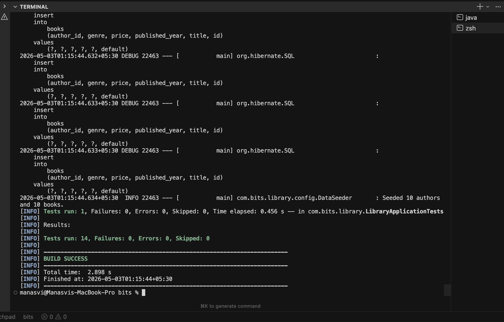
*Figure 11 — `mvn test`: all 14 unit tests pass across `BookRepositoryTest` (5), `BookServiceTest` (3), `AuthorServiceTest` (5), and `LibraryApplicationTests` (1). BUILD SUCCESS.*

---

## 7. Running the App

See [README.md](README.md) for full setup.

**Clone & run (H2 — zero setup):**
```bash
git clone https://github.com/Manasvi-247/library-management-springboot.git
cd library-management-springboot
mvn spring-boot:run -Dspring-boot.run.profiles=h2
```
Then visit <http://localhost:8080/>.

**MySQL profile (default):**
```bash
mvn spring-boot:run
```
The schema `library_db` is auto-created via `createDatabaseIfNotExist=true`. Defaults to `root`/`root` — override in `src/main/resources/application-mysql.properties`.

**Run tests:**
```bash
mvn test
```

---

## 8. Challenges & Resolutions

| Challenge                                                                 | Resolution                                                                                                            |
|---------------------------------------------------------------------------|-----------------------------------------------------------------------------------------------------------------------|
| **JSP + Spring Boot 3 (Jakarta) JSTL imports**                            | Used `jakarta.tags.core` URI and the matching Glassfish `jakarta.servlet.jsp.jstl` 3.0.x runtime — `javax.*` is dead. |
| **`LazyInitializationException`** when rendering `${author.books}` in JSP | Two paths: keep `spring.jpa.open-in-view=true`, or project the joined data into a flat DTO. We use the DTO for the join page. |
| **Surfacing integrity violations as friendly UI errors**                  | `@ControllerAdvice` converts `DataIntegrityViolationException` into a styled 409 page instead of a stack trace.       |
| **Form-binding for the `Book → Author` foreign key**                      | Bound `authorId` as a separate request parameter; the service fetches the `Author` and assigns the relationship before save. |
| **Mockito failed on Java 25** (`Byte Buddy could not instrument…`, `Java 25 (69) is not supported`) | Bumped `byte-buddy` to 1.15.11 and `mockito` to 5.14.2 in `pom.xml`, plus added `-Dnet.bytebuddy.experimental=true` to the surefire `argLine` so the JVM-25 class-file format is accepted during mock generation. |

---

## 9. Submission Checklist (Rubric Cross-Walk)

| Rubric                                     | Where to look                                                                  |
|--------------------------------------------|--------------------------------------------------------------------------------|
| **Entities & relationships (10%)**         | `entity/Author.java`, `entity/Book.java`                                       |
| **CRUD functionality (30%)**               | Controllers under `controller/`, JSPs under `WEB-INF/views/`                   |
| **Inner-join custom query**                | `BookRepository.findAllAuthorsWithBooks` + `/books/joined` page                |
| **Spring Boot layering (30%)**             | `controller/`, `service/`, `repository/` packages                              |
| **UI (10%)**                               | `webapp/resources/css/styles.css` + JSPs                                       |
| **Testing & validation (10%)**             | `src/test/java/...` and `GlobalExceptionHandler`                               |
| **Documentation (10%)**                    | This file + `README.md`                                                        |

---

## 10. Figures Index

| Figure | Topic                                                      | Section |
|--------|------------------------------------------------------------|---------|
| 1      | H2 console — 10 authors + 10 books seeded                  | 4.1     |
| 2      | New Author form                                            | 4.2     |
| 3      | Validation errors on form submit                           | 4.2     |
| 4      | 409 page on duplicate email                                | 4.2     |
| 5      | Authors list                                               | 4.3     |
| 6      | Books list                                                 | 4.3     |
| 7      | Inner-join projection page                                 | 4.3     |
| 8      | Inner-join filtered by genre                               | 4.3     |
| 9      | Edit Author form pre-filled                                | 4.4     |
| 9b     | Update success — flash + country changed                   | 4.4     |
| 10     | Dashboard hero with stat cards                             | 5       |
| 11     | `mvn test` output — 14/14 tests pass, BUILD SUCCESS        | 6       |

---

_End of report._
